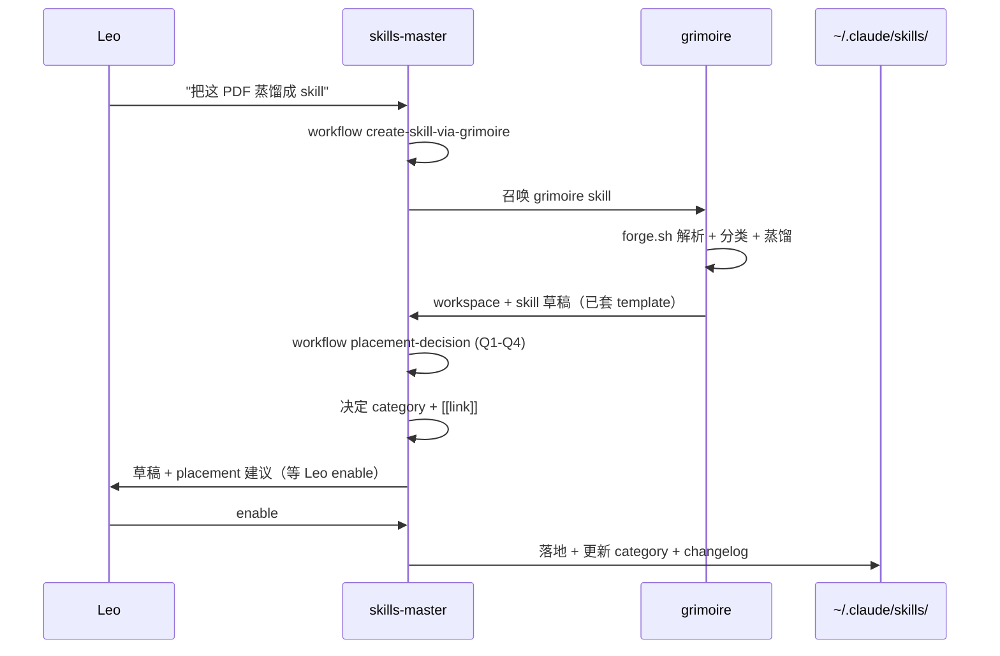

# Grimoire v2 · As a Skill Forge Engine

> **v2 定位升级**：Grimoire 从"PDF → 笔记 + skill pack 工具"升级为 **Universal Skill Forge** — 通用 skill 生产底层引擎，由 `skills-master` (Skill Strategist) 作为 manager 调用。

## v1 vs v2 关系

| 维度 | v1 (3-16 ~ 5-19) | v2 (2026-06+) |
|---|---|---|
| 定位 | 工具 (PDF → 笔记 + skill) | **底层引擎**（任何源 → 标准化 skill 草稿） |
| 用户 | 直接 Leo / agent 用 forge.sh | `skills-master` 作为 manager 调用 |
| 输入源 | PDF/DOC/PPT/img/video/B站/YouTube/text/md | + 网页 + Obsidian + GitHub repo + 音频 |
| 输出 | workspace（agent 自由消费）| **标准化 skill 草稿**（套 skills-master template）|
| 分类 | 11 source-types | + 12 skills-master category 自动归位 |
| 装机 | `skills enable <name>` 显式 opt-in | 同上 + 走 skills-master integrate-external-skill |

## v2 架构（4 层）

```
┌──────────────────────────────────────────────────┐
│  Layer 1: Input Source Adapters（多源标准化）      │
│  PDF / video / web / Obsidian / GitHub /         │
│  audio / Notion / Slack / 微信公众号 / text       │
│       ↓ Universal Markdown + metadata.json       │
├──────────────────────────────────────────────────┤
│  Layer 2: Smart Classifier（智能分类）            │
│  reading-types (3): book/paper/document          │
│  source-types (11): book/course/paper/...        │
│  skills-master-categories (12): 自动归位         │
│       ↓ + 推荐 skill type (thin/thick/meta)      │
├──────────────────────────────────────────────────┤
│  Layer 3: Distillation Engine（蒸馏）            │
│  reading-notes-pack.sh + source-skill-pack.sh    │
│  + agent re-learning pass                        │
│       ↓ workspace                                │
├──────────────────────────────────────────────────┤
│  Layer 4: Quality Gate（验证 + 接口）            │
│  - MVQ (已有: > 2KB, anchors, wikilinks)         │
│  - description 强度检查（v2 新增）                │
│  - 触发冲突 grep skills-master 现有 skill        │
│  - 输出符合 skills-master template 的 skill 草稿 │
└──────────────────────────────────────────────────┘
```

## 跟 skills-master 接口（3 种调用方式）

### A. Claude Code skill 模式（推荐 — 已 symlink 本机）

```
~/.claude/skills/grimoire → ~/Projects/grimoire-skill
```

skills-master 召唤 grimoire skill → grimoire 调 forge.sh → 输出 workspace + skill 草稿。

### B. CLI 模式

```bash
~/Projects/grimoire-skill/scripts/forge.sh <source> \
  --category-target=skills-master \
  --output-format=skill-draft
```

### C. REST API 模式（v3 计划，本阶段不做）

---

## skills-master ↔ grimoire 流程



## 11 source-types → 12 skills-master categories 映射

见 [`scripts/lib/skills-master-categories.sh`](../scripts/lib/skills-master-categories.sh)。

| Source type | 推荐 skills-master category | 推荐 skill type |
|---|---|---|
| book | 02-product-methodology（产品方法论书）OR 05-books（其他书） | thin-index + 2 thick |
| paper | 03-wdkns-system（5 道口 paper 系列）OR 05-books | thin-index |
| course | 06/07/08/09（CSDIY/DLAI/MIT/other） | thin-index |
| manual | 01-functional（工具手册）| thick-workflow |
| article-collection | 05-books | thin-index |
| project-notes | 01-functional | thick-workflow |
| video | 03-wdkns-system（B站 UP）OR 09-other-courses（CrashCourse 等）| thin-index |
| audio | 03-wdkns-system（podcast 笔记）| thin-index |
| web | 05-books（博客文章）OR 01-functional（工具文档）| thin-index |
| mixed | 04-meta-index（聚合多源）| meta-index |
| github-repo (v2 新增) | 01-functional（工具 repo）OR 05-books（学习 repo）| thick-workflow |
| obsidian-vault-segment (v2 新增) | 看具体笔记内容路由 | thin-index |

## v2 路线图

### Phase 1: skills-master 接口（**当前**）
- [x] 设计文档（本文件）
- [x] symlink ~/.claude/skills/grimoire
- [ ] SKILL.md 触发词升级
- [ ] scripts/lib/skills-master-categories.sh
- [ ] templates/skill-pack/{thin,thick,meta}.md

### Phase 2: 分类升级
- [ ] reading-types.sh + source-types.sh 升级
- [ ] 自动 detect 该归 12 类目哪个
- [ ] manifest.json 输出 category 推荐

### Phase 3: 输入源扩展
- [ ] 网页（Crawl4AI / Reader）
- [ ] Obsidian vault
- [ ] GitHub repo
- [ ] 音频（Whisper）

### Phase 4: 文档 + 测试 + push
- [ ] README v2 大改
- [ ] make test 全绿
- [ ] PR + merge

## 关联文档

- `~/.claude/skills/skills-master/SKILL.md` — Manager
- `~/.claude/skills/skills-master/references/workflows/create-skill-via-grimoire.md` — skills-master 调 grimoire 流程
- `~/.claude/skills/skills-master/references/templates/{thin,thick,meta}-index-skill.md` — Skill 模板源（grimoire 复用）
- `README.md` — Grimoire 用户面 v1 文档（v2 升级后追加）
- `SKILL.md` — Grimoire Claude Code skill 入口
